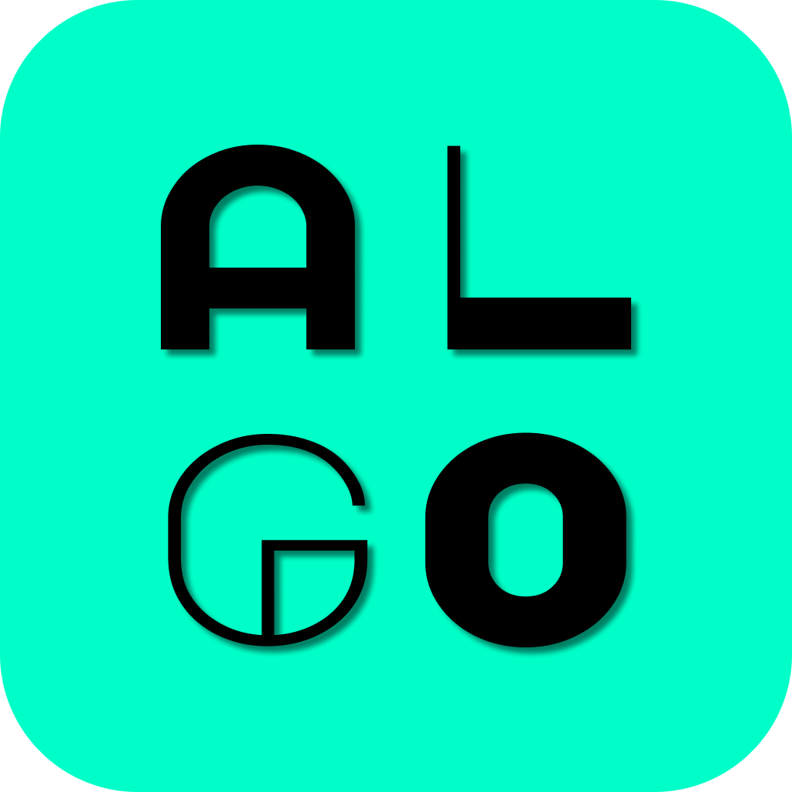
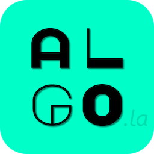

 
 

# algo.la
*Visual representation & algorithmic trading web and native mobile app.*

 

 

## Table of Contents

* [Getting started](#getting-started)
  * [Prerequisites](#prerequisites)
  * [Installation](#installation) 
* [About project](#about-project)
  * [Problem](#problem)
  * [Solution](#solution)
* [Planning](#planning)
  * [Personas](#personas)
  * [User stories](#user-stories)
  * [Business model](#business-model)
  * [Mongoose schemas](#mongoose-schemas)
  * [Kanban](#kanban)
* [Visual design](#visual-design)
  * [Wireframes](#wireframes)

 
